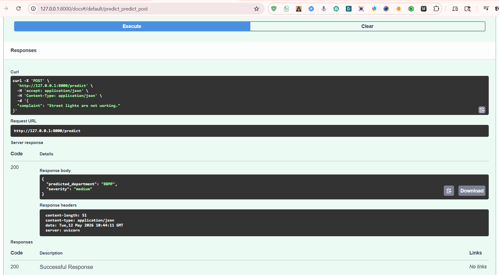
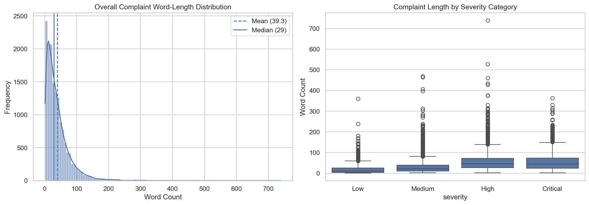
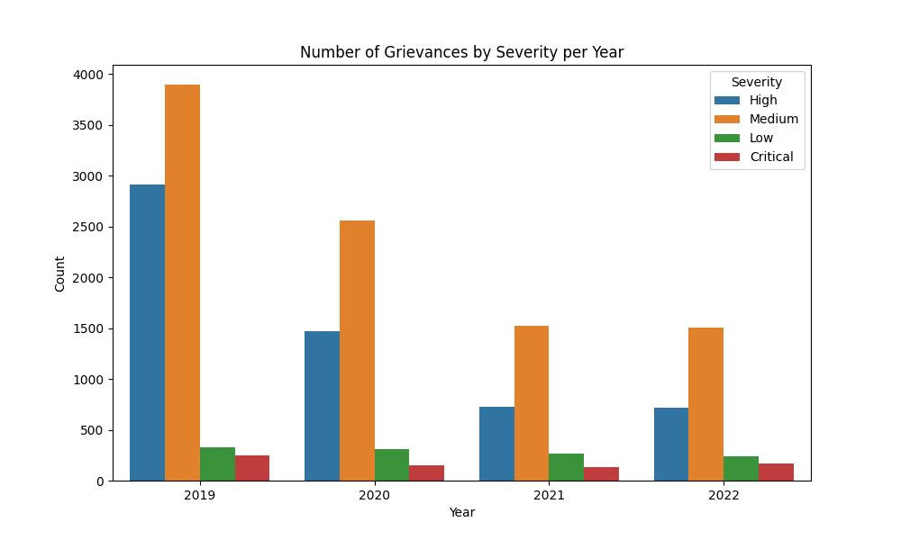

## 1. AI-Powered Civic Grievance Classification System

An NLP-based multi-output complaint routing system that automatically predicts:
- responsible civic department
- complaint severity

Built using FastAPI, HTML5/Tailwind SPA, PyTorch Transformers (DistilBERT, RoBERTa, DeBERTa v3, T5), Supabase, and Hugging Face Spaces.

## 2. Live Demo

- Web App: https://huggingface.co/spaces/sandipanarnab/grievance_iq
- GitHub: https://github.com/sandipan-ds/ai_grievance_system

## 3. Application Preview

The application provides an interactive civic grievance dashboard for automated complaint analysis and prioritization.

### Main Features

- Complaint department prediction (Weighted Soft-Voting Ensemble)
- Complaint severity classification (Text-Pair RoBERTa Classifier)
- Real-time severity reason generation (Sequence-to-sequence T5 Model)
- Interactive operational analytics dashboard
- Real-time prediction logs & telemetry
- Live Chart.js visualizations

### Dashboard Overview

The glassmorphic SPA dashboard enables users to:

- Submit civic complaints in natural language
- Automatically classify complaints into departments
- Predict severity levels:
  - Critical
  - High
  - Medium
  - Low
- Visualize complaint trends using interactive charts
- Monitor complaint statistics across departments

### Screenshots

#### Live Interactive Dashboard (FastAPI Tailwind SPA)


#### FastAPI OpenAPI / Swagger Documentation


## 4. Problem Statement

Large civic grievance systems receive thousands of complaints daily.
Manual routing and prioritization are slow and inconsistent.

This project automates:
- complaint department classification
- severity prioritization
- complaint analytics

## 5. Features

- **Multi-output Deep Learning Classification**: Predicts agency and severity in a unified pipeline.
- **Blended Civic Ensemble**: Weighted Soft Voting across DistilBERT, RoBERTa, and DeBERTa v3.
- **T5-base Reason Generator**: Generates chain-of-thought severity explanations.
- **RoBERTa Severity Pair Classifier**: Classifies concatenations of complaint description and T5 severity reasons.
- **FastAPI Core Backend**: Asynchronous endpoints for prediction, operational telemetry logging, and historical analytics calculations.
- **Vanilla JS & Tailwind SPA**: Glassmorphic cards, responsive KPIs, and live Chart.js visual shares.
- **Automated Mock testing**: Fast pytest validation without weight downloads or GCP logins on CI runners.

## 6. Tech Stack

### 6.1 Machine Learning
- DistilBERT, RoBERTa, DeBERTa v3, T5-base (PyTorch Transformers)
- XGBoost
- Scikit-learn
- NLTK
- Pandas, Numpy

### 6.2 Backend
- FastAPI
- Pydantic

### 6.3 Frontend
- FastAPI-served HTML5 / JavaScript Single Page Application (SPA)
- Tailwind CSS (Premium Glassmorphic Layout)
- Chart.js (Real-time Analytics Charts)
- Lucide Icons

### 6.4 Database
- Supabase PostgreSQL

### 6.5 Deployment
- Hugging Face Spaces
- Docker

### 6.6 Experiment Tracking
- DVC

## 7. System Workflow

Complaint Text
      ↓
Text Preprocessing & Lemmatization
      ↓
Civic Agency Classifier: Weighted Soft-Voting Ensemble (DistilBERT + RoBERTa + DeBERTa v3)
      ↓
Severity CoT Reason Generator (T5 Base)
      ↓
Severity Classifier (Custom RoBERTa Classifier Head)
      ↓
FastAPI Backend (Prediction, Telemetry, and Analytics Endpoints)
      ↓
Tailwind Glassmorphic SPA Dashboard (Real-time charts, table summary, and logs)

## 8. Data Pipeline & Exploratory Data Analysis (EDA)

The project uses civic grievance complaint data retrieved from Supabase PostgreSQL (16,107 raw records) and prepared through a rigorous cleaning and analysis pipeline corresponding to **Notebook Sections 1 & 2**:

### 8.1 Data Cleaning & Standardisation (Notebook Section 1)
* **Missing Value Analysis**: Null checks are run across description and severity labels; rows missing mandatory targets are dropped.
* **Civic Agency Standardisation**: Canonical names and acronyms are consolidated (e.g. merging Bruhat Bengaluru Mahanagara Palike into *BBMP*) and label sparsity is reduced by merging sparse categories.
* **Deduplication**: Identical complaints are deduplicated and index is reset.

### 8.2 Exploratory Data Analysis (Notebook Section 2)

#### 8.2.1 Complaint Length Distribution
* Word count is evaluated across severity levels.
* We perform log-transformation analysis to detect outliers. We establish a lower bound of 1 word (discarding contextless character strings) and an upper bound of 108 words (covering 95% of complaints).




#### 8.2.2 Grievance Volume Over Time
* Grievances are tracked year-over-year, indicating a rising volume of complaints between 2020 and 2024, with severity breakdown showing consistent ratios.




#### 8.2.3 Complaint Distribution per Civic Agency
* BBMP constitutes the majority of complaints (~59.2%), with BWSSB and BESCOM following. Distribution graphs identify highly burdened departments.


## 9. Model Performance & Evaluation Pipeline (Dataset V2)

This section maps the model training, ensembling, and validation workflow step-by-step as outlined in the [ai_grievance_system_fixed.ipynb](notebook/ai_grievance_system_fixed.ipynb) notebook.

---

### 9.1 Data Preparation & Exploratory Analysis (Notebook Sections 1 & 2)
1. **Data Retrieval & Cleaning**: standardizes null entries and deduplicates complaints fetched from Supabase PostgreSQL.
2. **Exploratory Data Analysis**: calculates complaint length distributions, volume over time, and distributions across agencies. 

---

### 9.2 Civic Agency Classification (Notebook Section 3)

#### 9.2.1 Text Preprocessing & Augmentation Setup
* Preprocessing cleans raw text (lowercasing, special characters/URL removal, tokenization, lemmatization, and stopword filtering).
* Text augmentation handles class imbalance across the 8 civic agencies.

#### 9.2.2 Classical ML Models
* Models evaluated: MultinomialNB (50.24% Macro F1), Logistic Regression (64.56% Macro F1), and LinearSVC (66.62% Macro F1).
* Optuna optimization is used for hyperparameter tuning.

#### 9.2.3 Deep Learning Transformer Models (5-Fold CV OOF)
* **DistilBERT**: Fine-tunes pre-trained `distilbert-base-uncased` on Vertex AI.
  * Training Script: [scripts/distilbert_train_civic_v2.py](scripts/distilbert_train_civic_v2.py)
  * Vertex AI Submission Script: [scripts/submit_vertex_job_civic_v2.py](scripts/submit_vertex_job_civic_v2.py)
* **RoBERTa**: Fine-tunes `roberta-base` on Vertex AI.
  * Training Script: [scripts/roberta_train_civic_v2.py](scripts/roberta_train_civic_v2.py)
  * Vertex AI Submission Script: [scripts/submit_vertex_job_civic_roberta_v2.py](scripts/submit_vertex_job_civic_roberta_v2.py)
* **DeBERTa v3**: Fine-tunes `microsoft/deberta-v3-base` on Vertex AI.
  * Training Script: [scripts/deberta_v3_train_civic_v2.py](scripts/deberta_v3_train_civic_v2.py)
  * Vertex AI Submission Script: [scripts/submit_vertex_job_civic_deberta_v3.py](scripts/submit_vertex_job_civic_deberta_v3.py)


#### 9.2.4 Complementarity Analysis & Stacking
* Sample-level disagreement shows **1,208 rescuable samples (7.5%)** leading to an Oracle Ceiling of **95.65% Accuracy**.
  * Visualization Chart: `charts_and_graphs/civic_agency_results/3.16_complementarity_analysis.png`
* **Hard-Label Stacking Ensemble**: trained on one-hot features.
  * Ensemble Script: [scripts/ensemble_hard_label_stacking.py](scripts/ensemble_hard_label_stacking.py)
  * Performance Charts: `3.17_stacking_per_agency_f1.png` and `3.17_stacking_delta_f1.png`
* **Weighted Soft Voting Ensemble (DistilBERT=0.45, RoBERTa=0.25, DeBERTa v3=0.30) - WINNER**: blends softmax probabilities, achieving **93.06% Accuracy / 0.7576 Macro F1**.
  * Extraction Script: [scripts/extract_probs_civic.py](scripts/extract_probs_civic.py)
  * Ensemble Script: [scripts/ensemble_soft_stacking.py](scripts/ensemble_soft_stacking.py)
  * Performance Charts: `3.18_soft_stacking_per_agency_f1.png` and `3.18_soft_stacking_delta_f1.png`

#### 9.2.5 Statistical Validation (McNemar's Test)
* Runs a McNemar Chi-Squared Test comparing the WSV Ensemble against single RoBERTa, yielding a Chi-Sq of **62.77** and a p-value of **$2.34 \times 10^{-15}$** (highly statistically significant).
  * Significance Script: [scripts/hypothesis_testing.py](scripts/hypothesis_testing.py)
  * Validation Chart: `charts_and_graphs/civic_agency_results/3.19_hypothesis_test_comparison.png`

---

### 9.3 Severity Classification (Notebook Sections 4 & 5 - Dataset V1)
* Dataset v1 severity classification uses classical algorithms, BiLSTM, and Joint DistilBERT regressor models.

---

### 9.4 Severity Classification (Notebook Section 6 - Dataset V2)

We run five different model architectures to evaluate complaint severity based on bucketized classes:

* **Trial 1: Using T5 (Joint Severity Score & Reason Generation)**
  * Details: Evaluates a joint T5 model to generate both severity scores and reasons.
  * Joint Model Script: [scripts/T5_train_severity_v2.py](scripts/T5_train_severity_v2.py)
  * Reason Generator Script: [scripts/T5_base_train_reason.py](scripts/T5_base_train_reason.py)
  * Vertex AI Submission Script: [scripts/submit_vertex_job_t5_base_reason.py](scripts/submit_vertex_job_t5_base_reason.py)
* **Trial 2: Regression using Classical Regressors**
  * Details: Fits tuned XGBoost models on TF-IDF vectors.
  * Regressor Script: [scripts/xgb_severity_regressor.py](scripts/xgb_severity_regressor.py)
  * Vertex AI Submission Script: [scripts/submit_vertex_job_severity_xgb.py](scripts/submit_vertex_job_severity_xgb.py)
* **Trial 3: DistilBERT Regressor**
  * Details: Fine-tunes a DistilBERT sequence model with a linear regression head.
  * Regressor Script: [scripts/distilbert_severity_regressor.py](scripts/distilbert_severity_regressor.py)
  * Vertex AI Submission Script: [scripts/submit_vertex_job_severity_distilbert_reg.py](scripts/submit_vertex_job_severity_distilbert_reg.py)
* **Trial 4: Regression using Complaint Description + Severity Reason (CoT)**
  * Details: Feeds T5-generated severity reasons concatenated with complaint text to an XGBoost regressor.
  * CoT Regressor Script: [scripts/xgb_severity_regressor_cot.py](scripts/xgb_severity_regressor_cot.py)
* **Trial 5: RoBERTa / DeBERTa Severity Classifier (Concatenated Text Pairs) - WINNER**
  * Details: concatenates complaint text and T5-generated reasons as sentence pairs, classification achieves **76.11% Accuracy / 0.7209 Macro F1** in production.
  * RoBERTa Training Script: [scripts/roberta_classifier_severity_v2.py](scripts/roberta_classifier_severity_v2.py)
  * RoBERTa Vertex Submission: [scripts/submit_vertex_job_severity_roberta_v2.py](scripts/submit_vertex_job_severity_roberta_v2.py)
  * DeBERTa v3 Training Script: [scripts/deberta_v3_classifier_severity_v2.py](scripts/deberta_v3_classifier_severity_v2.py)
  * DeBERTa v3 Vertex Submission: [scripts/submit_vertex_job_severity_deberta_v3.py](scripts/submit_vertex_job_severity_deberta_v3.py)

## 10. Deployment

The application is containerized using Docker and deployed on Hugging Face Spaces.

### Deployment Stack
- **Containerization**: Docker (multi-model configuration)
- **Deployment Platform**: Hugging Face Spaces (CPU Basic tier)
- **Backend API**: FastAPI (Starlette Lifespan for memory-isolated initialization)
- **Frontend Dashboard**: Tailwind CSS & Vanilla JS Glassmorphic SPA (asynchronous predictions, Chart.js analytics)

### Run Locally

```bash
# 1. Install dependencies
pip install -r requirements.txt

# 2. Run the FastAPI SPA locally
# (Loads production weights on startup. Set MOCK_MODELS=1 to run fast mock-based UI testing)
uvicorn src.main:app --host 0.0.0.0 --port 7860

# 3. Build & Run via Docker locally
docker build -t ai-grievance-system:latest .
docker run -p 7860:7860 ai-grievance-system:latest
```

Open [http://localhost:7860](http://localhost:7860) in your browser.

## 11. Automated Testing & CI/CD

We developed a unit test suite in [tests/test_api.py](tests/test_api.py) validating text cleaning, lemmatization/stopword filtering, model loader mock configuration, predictor ensembling logic, health check endpoints, predictions, and operational analytics logic.

* **Test Framework**: Pytest
* **CI Integration**: GitHub Actions workflow configured under `.github/workflows/pytest.yml`
* **Test Isolation**: Runs fully offline in mock mode to bypass weight downloads or credentials inside Github runner.
* **Execution Command**:
  ```bash
  pytest tests/
  ```
  *Result: 7 passed in 14.35s*


