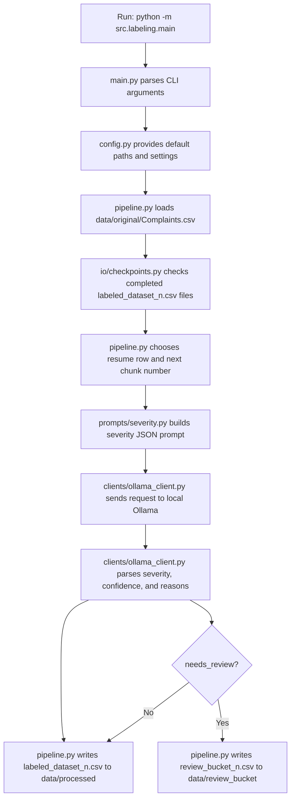

# AI Grievance System

Project 1: AI-driven citizen grievance severity labeling and NLP pipeline.

## Severity Labeling

Start Ollama locally and make sure a supported model is available:

```powershell
ollama pull llama3.3
ollama serve
```

Run the labeler from the project root:

```powershell
.\.venv\Scripts\python.exe -m src.labeling.main
```

If you already have `qwen2.5:latest` installed in Ollama, use this command instead:

```powershell
.\.venv\Scripts\python.exe -m src.labeling.main --model qwen2.5:latest
```

Note: the project defaults to `llama3.3`, so if that model is not installed you must either pull it first or pass `--model` with an installed Ollama model.

The script reads `data/original/Complaints.csv`, adds severity metadata, and saves one completed file for every 500 rows:

The model call is fixed to deterministic decoding (`temperature=0`, `top_p=1`, `top_k=1`) so repeated runs stay stable.

```text
data/processed/labeled_dataset_1.csv
data/processed/labeled_dataset_2.csv
data/processed/labeled_dataset_3.csv
```

Rows that fail labeling or have confidence below the review threshold are also copied as CSV files here:

```text
data/review_bucket/review_bucket_1.csv
data/review_bucket/review_bucket_2.csv
data/review_bucket/review_bucket_3.csv
```

The review bucket intentionally stays in CSV format so a human reviewer can open it in Excel, Google Sheets, pandas, or a notebook. Review files include these extra manual-review columns:

```text
human_reviewed
human_severity
review_notes
```

Resume is automatic. If `labeled_dataset_1.csv` and `labeled_dataset_2.csv` already exist, the next run starts from row 1001 and writes `labeled_dataset_3.csv`.

Each processed chunk includes:

```text
severity
confidence_score
reason_high_confidence
reason_ambiguity
needs_review
labeling_error
raw_model_response
```

For a quick test run:

```powershell
.\.venv\Scripts\python.exe -m src.labeling.main --limit 10 --start-row 1 --output-dir data/processed/test_run --review-dir data/review_bucket/test_run
```

To use a specific Ollama model tag:

```powershell
.\.venv\Scripts\python.exe -m src.labeling.main --model llama3.3
```

By default, rows with confidence below `0.80` are sent for human review. To change that cutoff:

```powershell
.\.venv\Scripts\python.exe -m src.labeling.main --review-confidence-threshold 0.80
```

## How It Works

The labeling pipeline is designed as a checkpointed batch process. It reads raw complaints from `data/original/Complaints.csv`, labels them with a local Ollama model, saves completed 500-row CSV chunks in `data/processed`, and copies uncertain rows into `data/review_bucket` for human review.



### Pipeline Steps

1. The user runs `src.labeling.main`.
2. `main.py` reads command-line arguments such as `--model`, `--chunk-size`, `--output-dir`, and `--review-confidence-threshold`.
3. `config.py` supplies default paths:
   `data/original/Complaints.csv`, `data/processed`, and `data/review_bucket`.
4. `pipeline.py` loads the CSV and normalizes column names.
5. `io/checkpoints.py` scans `data/processed` for complete files named `labeled_dataset_1.csv`, `labeled_dataset_2.csv`, and so on.
6. Based on completed chunks, the pipeline resumes from the correct row. For example, if two 500-row chunks exist, it resumes from row 1001.
7. For each complaint row, `prompts/severity.py` builds a strict JSON prompt using the title, description, category, subcategory, and civic agency.
8. `clients/ollama_client.py` checks that the requested Ollama model is available, sends the prompt to `http://localhost:11434/api/generate`, and parses the JSON response.
9. `pipeline.py` writes the labeled rows to `data/processed/labeled_dataset_n.csv`.
10. If the model fails or confidence is below the threshold, the row is also copied to `data/review_bucket/review_bucket_n.csv`.

### File Responsibilities

```text
src/labeling/main.py
  CLI entrypoint. Converts command-line options into a LabelingConfig and starts the pipeline.

src/labeling/config.py
  Central default settings: input path, processed output path, review bucket path, model name, chunk size, retries, and confidence threshold.

src/labeling/pipeline.py
  Orchestrates the full labeling run: load CSV, resume from checkpoints, call Ollama, add label columns, save processed chunks, and save review CSVs.

src/labeling/prompts/severity.py
  Contains the severity definitions, JSON output instruction, and severity cleanup logic.

src/labeling/clients/ollama_client.py
  Talks to the local Ollama API, validates model availability, sends prompts, retries failures, and parses model JSON into structured fields.

src/labeling/io/checkpoints.py
  Finds completed numbered chunks, calculates the resume row, and saves processed or review CSV files atomically.

src/labeling/ollama.py
  Compatibility runner. It exists so older commands can still start the same main pipeline.
```

### Data Flow

```text
data/original/Complaints.csv
  -> src.labeling.main
  -> src.labeling.pipeline
  -> src.labeling.prompts.severity
  -> src.labeling.clients.ollama_client
  -> data/processed/labeled_dataset_n.csv
  -> data/review_bucket/review_bucket_n.csv, only when review is needed
```

The processed files are the main labeled dataset. The review bucket is a smaller human-check queue for low-confidence or failed labels. Reviewers can fill `human_reviewed`, `human_severity`, and `review_notes` directly in the CSV files.

## Folder Structure

```text
data/original/Complaints.csv     Raw full dataset
data/original/sample_dataset.csv Raw small sample
data/processed/                  Completed labeled chunks
data/review_bucket/              CSV review files for low-confidence or failed labels
src/labeling/prompts/severity.py Severity rules and label cleaning
src/labeling/clients/ollama_client.py Ollama API client
src/labeling/io/checkpoints.py   Numbered chunk detection and saving
src/labeling/pipeline.py         CSV loading, row iteration, and chunk writing
src/labeling/main.py             Command-line entrypoint
src/labeling/ollama.py           Backward-compatible entrypoint
```
