# AI-Powered Civic Grievance Classification System: End-to-End Project Execution

This document outlines the comprehensive end-to-end execution of the **Grievance IQ** project. This project implements a multi-output NLP routing system that automatically predicts the responsible civic department and severity level for citizen complaints. 

The architecture bridges state-of-the-art Natural Language Processing (Transformers, Ensembling, Chain-of-Thought) with a production-ready Web API (FastAPI) and an interactive dashboard.

---

## 1. Project Architecture & Ecosystem

The system follows a modular architecture spread across various scripts and notebooks.
*   **Data Pipeline & ML Notebooks (`../notebooks/`)**: Interactive development using Jupyter Notebooks (`../notebooks/ai_grievance_system_fixed.ipynb`) for EDA, model baselining, and visualization.
*   **Training & Cloud Integration (`../scripts/`)**: Standalone scripts to offload heavy model training to GCP Vertex AI (`submit_vertex_job_*.py`), download results, extract probabilities (`../scripts/extract_probs_civic.py`), and ensemble models (`../scripts/ensemble_soft_stacking.py`).
*   **Production API (`../src/inference/`)**: A FastAPI backend (`main.py`, `predictor.py`, `model_loader.py`) handling asynchronous requests, routing text through the ML pipeline, and logging telemetry.
*   **Frontend (`../src/inference/static/`)**: A Vanilla JS + Tailwind CSS single-page application (SPA) providing an interactive, glassmorphic UI with Chart.js analytics.
*   **Deployment**: Docker containerization pushed to Hugging Face Spaces.

---

## 2. Phase 1: Data Collection and Labeling
> *Note: Details regarding data collection, scraping procedures, and manual labeling strategies will be added here tomorrow.*

---

## 3. Phase 2: Data Preprocessing & Exploratory Data Analysis (EDA)

The initial phase dealt with preparing the raw data retrieved from Supabase PostgreSQL (comprising 16,107 raw grievance records).

### 3.1 Cleaning and Standardisation
*   **Null Handling**: Null checks were performed across textual descriptions and severity labels. Any rows missing mandatory target variables were discarded.
*   **Label Standardisation**: Variations in agency names were canonicalized. For example, "Bruhat Bengaluru Mahanagara Palike" was merged into standard acronyms like *BBMP* to reduce label sparsity.
*   **Deduplication**: Exact duplicate complaints were removed to prevent data leakage between train and validation splits.

### 3.2 Exploratory Data Analysis
EDA highlighted critical distributions and class imbalances:
*   **Length Distribution**: Log-transformation analysis determined standard complaint lengths, establishing a range from 1 to 108 words (covering 95% of data).
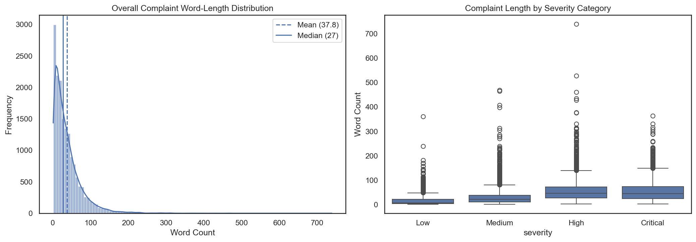
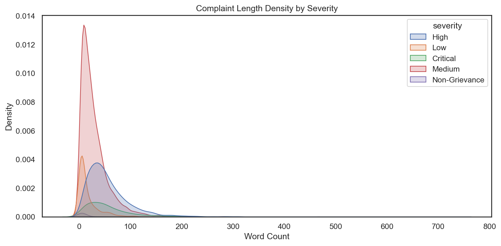
*   **Temporal Volume**: The volume of grievances showed consistent year-over-year growth from 2020 to 2024.
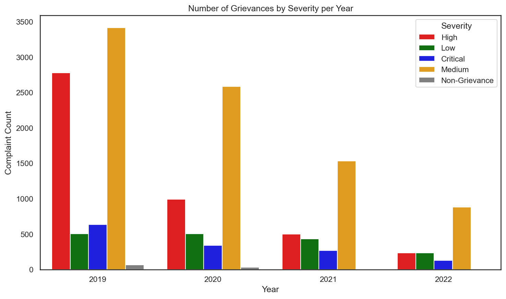
*   **Agency Burden**: The data was heavily skewed towards BBMP (~59.2% of all complaints), followed by BWSSB and BESCOM, necessitating techniques to handle severe class imbalance during model training.
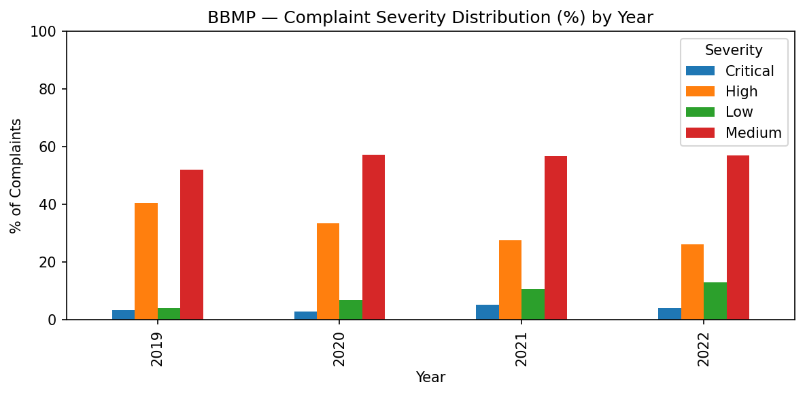

---

## 4. Phase 3: Civic Agency Classification

The first core predictive task was routing complaints to the correct civic agency out of 8 possible categories.

### 4.1 Classical ML Baselines
Initial experiments explored classical NLP pipelines with TF-IDF and Optuna hyperparameter tuning:
*   *Multinomial Naive Bayes*: 50.24% Macro F1
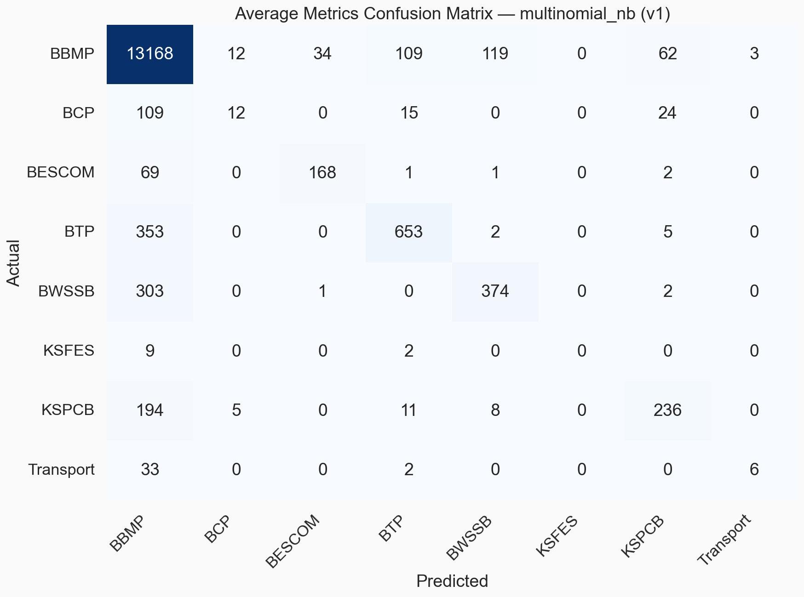
*   *Logistic Regression*: 64.56% Macro F1
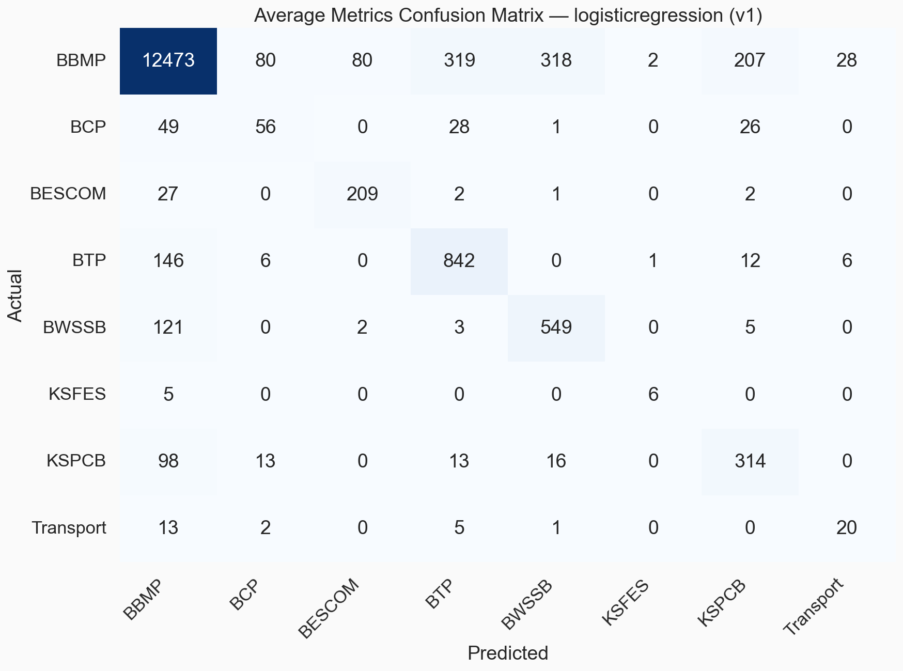
*   *LinearSVC*: 66.62% Macro F1
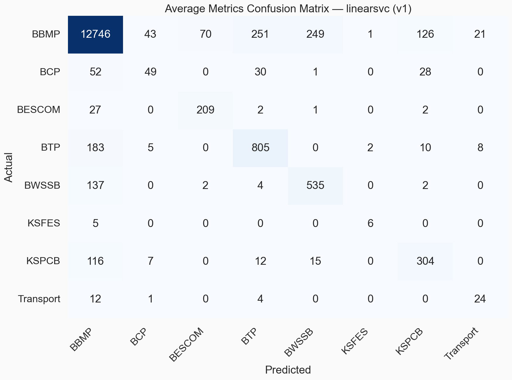

### 4.2 Deep Learning Transformers (Dataset V2)
To capture deep semantic context, three base transformer architectures were fine-tuned via GCP Vertex AI:
1.  **DistilBERT** (`distilbert-base-uncased`)

2.  **RoBERTa** (`roberta-base`)

3.  **DeBERTa v3** (`microsoft/deberta-v3-base`)

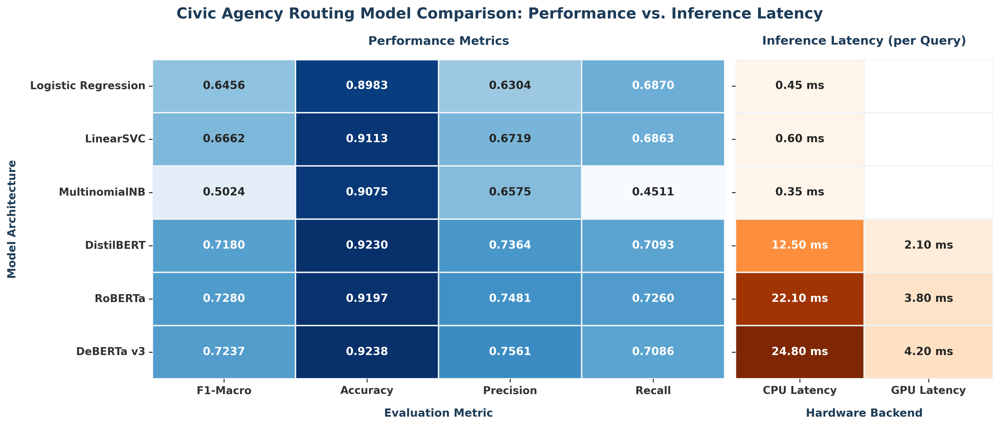

A 5-Fold Cross Validation out-of-fold (OOF) strategy was employed to ensure robust evaluation without overfitting.

### 4.3 Model Ensembling & Complementarity
Instead of picking a single model, an in-depth **Complementarity Analysis** was run. It revealed that individual models disagreed on certain samples, leaving 1,208 rescuable samples (7.5%) and establishing a theoretical Oracle Ceiling of 95.65% Accuracy.

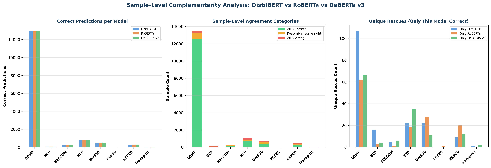

*   **Hard-Label Stacking**: Trained an overarching ensemble on the discrete predictions of the three models.
*   **Weighted Soft-Voting Ensemble (The Winner)**: By blending the softmax probability distributions of the models with custom weights (`DistilBERT=0.45`, `RoBERTa=0.25`, `DeBERTa v3=0.30`), the ensemble reached **93.06% Accuracy and 0.7576 Macro F1**.
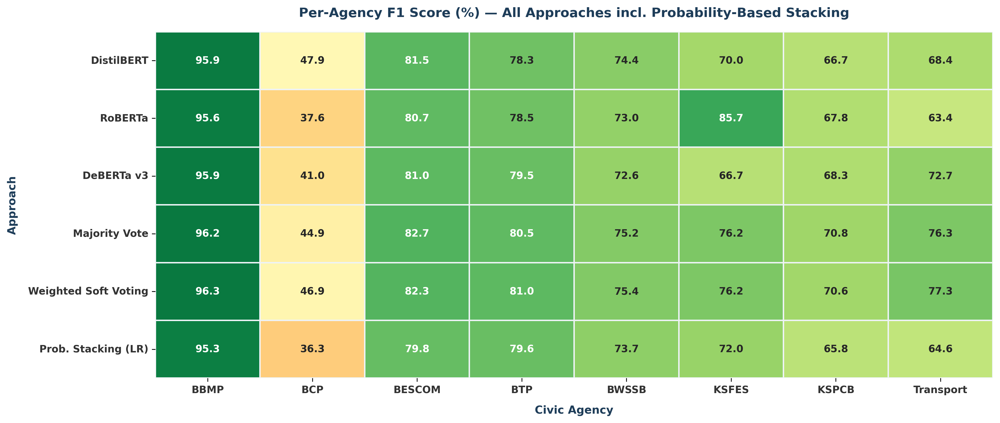

### 4.4 Statistical Validation
To prove the ensemble wasn't just incrementally better by chance, a **McNemar's Chi-Squared Test** was run (`../scripts/hypothesis_testing.py`) comparing the ensemble against the single RoBERTa model. The resulting p-value of $2.34 \times 10^{-15}$ confirmed the ensemble's superiority was statistically significant.

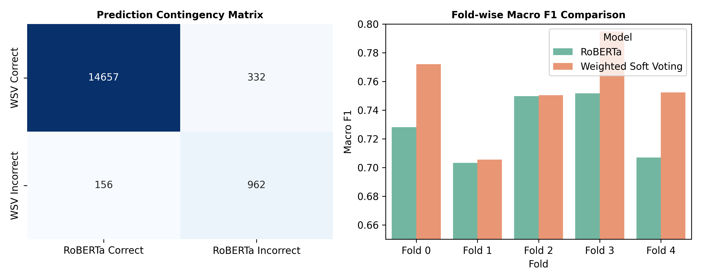

---

## 5. Phase 4: Severity Prioritization (Chain of Thought)

The second objective was assessing how urgent the complaint is. Five distinct architectural trials were conducted to optimize severity prediction:

1.  **T5 Joint Scoring**: A generative T5 model trained to output severity score and reasoning.

2.  **Classical Regressors**: XGBoost models fit on TF-IDF vectors.

3.  **DistilBERT Regressor**: Sequence classification model with a linear regression head.
4.  **XGBoost + CoT Reason**: XGBoost trained on concatenations of complaint description and T5-generated severity reason.
5.  **RoBERTa / DeBERTa Classifier (The Winner)**: A text-pair classifier approach. 
    *   **Step A**: A specialized T5-base model generates a natural language "reason" for the severity based on the text.
    *   **Step B**: The original complaint text and the T5-generated reason are concatenated.
    *   **Step C**: This context-enriched text pair is fed into a RoBERTa (or DeBERTa v3) classifier. 
    *   **Result**: Reached **76.11% Accuracy and 0.7209 Macro F1**.

---

## 6. Phase 5: Production Backend Engineering (FastAPI)

The inference logic was extracted from the notebooks and refactored into a scalable FastAPI application (`../src/inference/main.py`).

*   **Model Initialization (`model_loader.py`)**: Utilizes Starlette Lifespan events to load all hefty PyTorch models (DistilBERT, RoBERTa, DeBERTa, and T5) into memory *once* upon server startup, isolating memory overhead.
*   **Inference Routing (`predictor.py`)**: 
    1. Receives raw complaint string.
    2. Invokes the Civic Agency Soft-Voting Ensemble to get department probabilities.
    3. Triggers the T5 Reason Generator to generate a chain-of-thought explanation.
    4. Passes the description + explanation pair into the Severity Classifier.
*   **Telemetry**: API requests, predictions, and processing times are logged to a Supabase PostgreSQL database for historical analytics.

---

## 7. Phase 6: Frontend Dashboard & Deployment

### 7.1 Single Page Application (SPA)
The user interface (`../src/inference/static/index.html`) was built natively without heavy node frameworks:
*   **Styling**: Tailwind CSS via CDN was used to create a premium, glassmorphic layout.
*   **Interactivity**: Vanilla JavaScript handles asynchronous API calls, updating the DOM dynamically.
*   **Analytics**: Chart.js generates real-time graphs displaying severity distributions and department routing statistics pulled from the FastAPI `/api/analytics` endpoint.
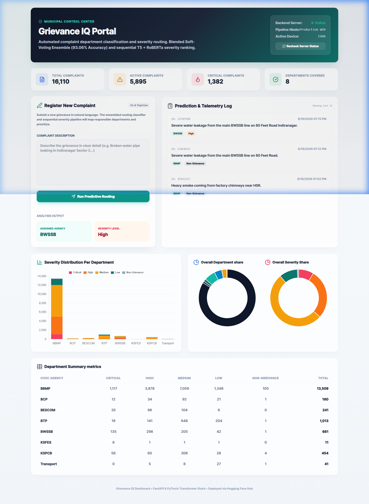

### 7.2 Containerization & CI/CD
*   **Docker**: The entire FastAPI backend and SPA frontend are containerized via a single `Dockerfile`. It exposes port `7860`.
*   **Testing**: Pytest (`../tests/test_api.py`) runs automated tests in an offline mock environment (avoiding huge model weight downloads during CI checks).
*   **Hugging Face Spaces**: The application was deployed via a GitHub Actions pipeline (`../.github/workflows/deploy.yml`) to a Hugging Face Space running the Docker container.
